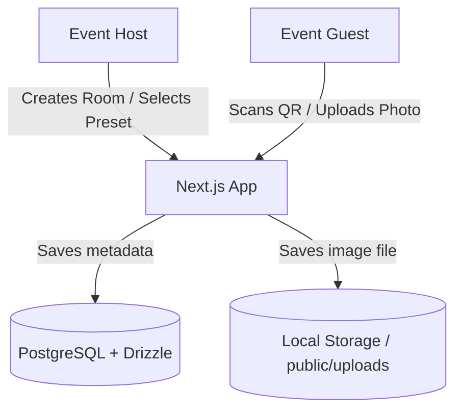
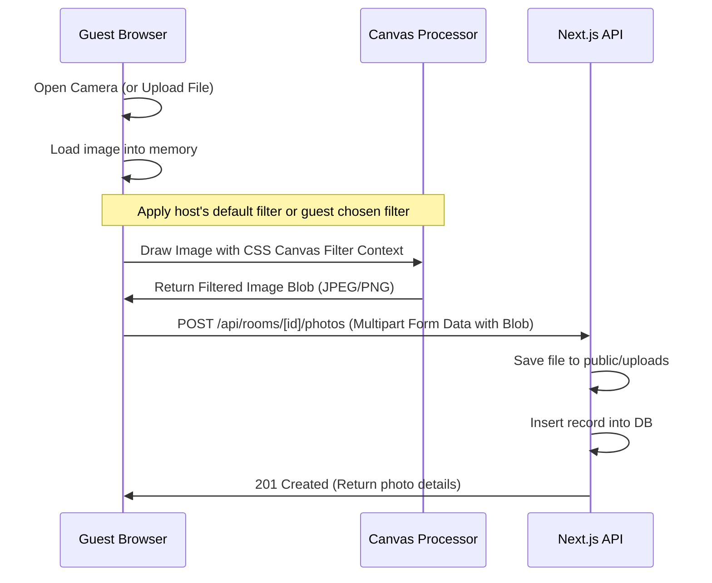

# Technical Design Document: POV Guest

POV Guest is a mobile-first web application designed to collect and showcase event/wedding photos taken directly from the guests' point of view (POV). Hosts can register, create event rooms, set default camera presets/filters, and generate a QR code. Guests scan the QR code, join the room, and take or upload photos with the preset filter applied by default.

---

## 1. System Architecture

* **Frontend**: Next.js (Pages Router, TypeScript)
* **Backend**: Next.js API Routes (Next.js server-side handler)
* **Database**: PostgreSQL with Drizzle ORM
* **Storage**: Local filesystem (`public/uploads`) for local development / MVP
* **Styling**: Vanilla CSS for mobile-first layout and premium aesthetics
* **Testing**: Jest + React Testing Library (RTL) for Test-Driven Development (TDD)

---

## 2. Database Schema (Drizzle ORM)

We will define three main tables: `hosts`, `rooms`, and `photos`.

### `hosts` Table
Tracks registered hosts who can create and manage multiple event rooms.

| Column | Type | Description |
| :--- | :--- | :--- |
| `id` | `uuid` (PK) | Unique host identifier |
| `name` | `varchar(255)` | Name of the host |
| `email` | `varchar(255)` (Unique) | Email address used for login |
| `passwordHash` | `varchar(255)` | Hashed password |
| `createdAt` | `timestamp` | Timestamp of host registration |

### `rooms` Table
Tracks event albums created by hosts.

| Column | Type | Description |
| :--- | :--- | :--- |
| `id` | `uuid` (PK) | Unique room identifier |
| `hostId` | `uuid` (FK) | Reference to `hosts.id` (tracks who owns the room) |
| `name` | `varchar(255)` | Name of the event / wedding (e.g. "John & Jane's Wedding") |
| `code` | `varchar(50)` (Unique) | URL slug / short code for QR entry |
| `presetFilter` | `varchar(50)` | Default filter name: `none`, `retro`, `classic-mono`, `warm-film`, `cyan-drift` |
| `createdAt` | `timestamp` | Timestamp of room creation |

### `photos` Table
Stores links and metadata for photos uploaded by guests.

| Column | Type | Description |
| :--- | :--- | :--- |
| `id` | `uuid` (PK) | Unique photo identifier |
| `roomId` | `uuid` (FK) | Reference to `rooms.id` |
| `guestName` | `varchar(100)` | Name of the guest who uploaded the photo |
| `imageUrl` | `text` | Local path or URL of the saved image |
| `filterApplied` | `varchar(50)` | The filter applied to the image: `none`, `retro`, `classic-mono`, etc. |
| `createdAt` | `timestamp` | Upload timestamp |

---

## 3. Client-Side Image Filtering Flow

To keep processing lightweight and instantaneous, camera filters are applied client-side using the HTML5 Canvas API before uploading.

### Available Filter Configurations (CSS/Canvas equivalents)
* **Retro**: `sepia(0.3) contrast(1.1) brightness(0.95) saturate(1.2)`
* **Classic Mono**: `grayscale(1) contrast(1.2) brightness(0.9)`
* **Warm Film**: `sepia(0.15) saturate(1.3) contrast(1.05) hue-rotate(-5deg)`
* **Cyan Drift**: `hue-rotate(180deg) saturate(0.8) sepia(0.1)`

---

## 4. REST API Endpoints

### Host Auth API
* `POST /api/auth/register` - Register a new host
  * **Payload**: `{ "name": "...", "email": "...", "password": "..." }`
  * **Response**: `201 Created` with host details and session cookie
* `POST /api/auth/login` - Authenticate host
  * **Payload**: `{ "email": "...", "password": "..." }`
  * **Response**: `200 OK` with session cookie
* `POST /api/auth/logout` - Clear host session
  * **Response**: `200 OK`

### Rooms API
* `POST /api/rooms` - Create a new event room (Requires authenticated Host)
  * **Payload**: `{ "name": "...", "presetFilter": "..." }`
  * **Response**: `201 Created` with Room details including `id` and `code`
* `GET /api/rooms/[code]` - Retrieve room details & active settings by code/slug
  * **Response**: `200 OK` with Room metadata
* `GET /api/hosts/rooms` - List all rooms owned by the logged-in host (Requires authenticated Host)
  * **Response**: `200 OK` with array of Rooms

### Photos API
* `POST /api/rooms/[roomId]/photos` - Upload a new guest photo
  * **Payload**: `Multipart Form Data` containing `photo` (file), `guestName`, and `filterApplied`
  * **Response**: `201 Created` with photo entry details
* `GET /api/rooms/[roomId]/photos` - Retrieve all uploaded photos in the room
  * **Response**: `200 OK` with array of photos sorted by `createdAt` descending

---

## 5. Test-Driven Development (TDD) Strategy

To build this project robustly, we will follow strict TDD:

1. **Database Schema & Migrations Tests**:
   * Write tests verifying schema validation (e.g. room names cannot be blank).
   * Write code to implement the Drizzle schema.
2. **API Endpoint Tests (Next.js API Handler)**:
   * Write tests for `POST /api/rooms` (expects success when valid, errors when invalid).
   * Implement handlers to make tests pass.
   * Write tests for photo upload (expects file saved + DB entry).
   * Implement upload API handler using a library like `formidable` or standard Next.js multi-part parsing.
3. **Component Tests (React + Jest)**:
   * **Camera View Test**: Verify the camera defaults to the room's preset filter, allows toggling, and outputs a modified image blob.
   * **Gallery View Test**: Verify photos are displayed and fetch correctly.

---

## 6. Implementation Task Plan (Linear Queue)

Here are the step-by-step tasks we will execute:

1. [ ] **Setup Project Base** ([PLR-12](https://linear.app/abdansyak/issue/PLR-12/setup-project-base)): Install Next.js (Pages Router, TypeScript), Jest, React Testing Library, Drizzle ORM, and database drivers.
2. [ ] **Drizzle Setup & Schema Definition** ([PLR-13](https://linear.app/abdansyak/issue/PLR-13/drizzle-setup-and-schema-definition)): Define database schemas for `hosts`, `rooms`, and `photos` tables with Drizzle, and write schema tests.
3. [ ] **Host Auth API** ([PLR-14](https://linear.app/abdansyak/issue/PLR-14/host-auth-api)): TDD for host registration, login, and session validation endpoints.
4. [ ] **Room API Routes** ([PLR-15](https://linear.app/abdansyak/issue/PLR-15/room-api-routes)): TDD for `POST /api/rooms` (authenticated), `GET /api/rooms/[code]`, and `GET /api/hosts/rooms` (authenticated).
5. [ ] **Photo Upload API Route** ([PLR-16](https://linear.app/abdansyak/issue/PLR-16/photo-upload-api-route)): TDD for uploading guest photos and saving metadata.
6. [ ] **Host Authentication UI** ([PLR-17](https://linear.app/abdansyak/issue/PLR-17/host-authentication-ui)): Register and login pages for event hosts.
7. [ ] **Host Dashboard & Room Creation UI** ([PLR-18](https://linear.app/abdansyak/issue/PLR-18/host-dashboard-and-room-creation-ui)): Host dashboard listing their created rooms, room creation form with filter preset picker, and QR code generation.
8. [ ] **Guest Camera/Upload UI** ([PLR-19](https://linear.app/abdansyak/issue/PLR-19/guest-cameraupload-ui)): Mobile-first photo capture page with default applied Canvas CSS filters and toggle functionality.
9. [ ] **Live Album Gallery UI** ([PLR-20](https://linear.app/abdansyak/issue/PLR-20/live-album-gallery-ui)): Real-time gallery view showing guest POV photos sorted chronologically.
